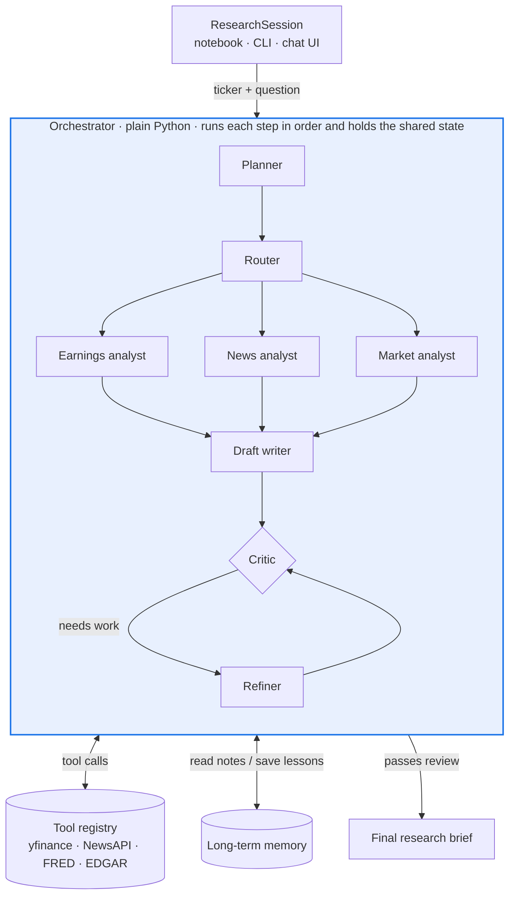

# Investment Research Agent

A multi-agent LLM system that researches a stock. You give it a ticker and a question. It plans its research, calls financial data tools, drafts a brief, critiques and improves the draft, and returns a sourced research brief. You can then ask follow-up questions in the same session.

Built in plain Python for the AAI-520 Natural Language Processing and GenAI course (University of San Diego, MS Applied AI).

> **Status:** project scaffold. Folders are in place; code is being added over the build phases below.

📄 **Detailed design document:** [Multi-Agent Investment Research System — Design Doc](https://docs.google.com/document/d/1PjKU47bT6VsPgoFgJWckJpvaSPAeqeclrmysAvf-fb8/edit?usp=sharing)

---

## Contents

1. [How it works](#how-it-works)
2. [Agents](#agents)
3. [Workflow patterns](#workflow-patterns)
4. [Critic and Refiner loop](#critic-and-refiner-loop)
5. [Memory and follow-up questions](#memory-and-follow-up-questions)
6. [Data sources](#data-sources)
7. [How to run it (planned)](#how-to-run-it-planned)
8. [Repository structure](#repository-structure)
9. [Team and task division](#team-and-task-division)
10. [Development workflow](#development-workflow)
11. [Design decisions](#design-decisions)
12. [Further reading](#further-reading)

---

## How it works

The **Orchestrator** is the controller that runs every request. It is a plain Python class that calls each agent in order, passes results between them through a shared state object (plan, evidence from every tool call, findings, drafts, critiques and a trace log), and records every step. It makes no LLM calls itself; the agents do.

Inside it, a **Planner** turns the question into ordered research steps. A **Router** sends each step to one of three specialist agents, which call data tools. A **Draft writer** merges their findings, and a **Critic–Refiner** loop must pass the draft before it is released. Notes and lessons from each run are saved to long-term memory so later runs plan better.



The system has six layers, and each layer only calls the one below it:

| Layer | Contents |
| --- | --- |
| 1. Interfaces | Jupyter notebook, command line, Gradio chat UI |
| 2. Session | `ResearchSession`: conversation state and context cache per thread |
| 3. Orchestration | Orchestrator (control loop + shared state), Planner, Router, Critic + Refiner loop |
| 4. Specialist agents | Earnings, News and Market analysts |
| 5. Tools | Market data, news and macro data, company filings |
| 6. Storage | Response cache, long-term memory, session store |

---

## Agents

All agents are plain Python classes built on a shared `BaseAgent` interface (name, system prompt, allowed tools, `run()`).

| Agent | What it does | Output |
| --- | --- | --- |
| Planner | Turns a ticker and question into an ordered step plan; reads notes from past runs | JSON plan (Pydantic) |
| Router | Sends each step to the right specialist and says why | `{route, reason}` |
| Earnings analyst | EPS surprise, financial ratios, passages from 10-K/10-Q filings | Earnings findings |
| News analyst | Runs the five-stage news prompt chain | Cited news digest |
| Market analyst | Price trend, volatility and macro context | Market findings |
| Draft writer | Merges findings into a structured brief (thesis, bull case, bear case, risks, metrics, stance) | Draft brief |
| Critic | Scores the draft on five dimensions and lists specific issues | Critique report |
| Refiner | Fixes only what the Critic flagged | Revised brief + change log |

---

## Workflow patterns

| Pattern | How it is used |
| --- | --- |
| **Prompt chaining** | The News analyst runs: ingest → preprocess (dedupe, clean, 30-day filter) → classify (topic + sentiment) → extract (entities, figures) → summarize (five cited bullets) |
| **Routing** | The Router classifies each research step and sends it to the earnings, news or market specialist |
| **Evaluator–optimizer** | The Draft writer produces a brief, the Critic scores it, and the Refiner revises it until it passes |

---

## Critic and Refiner loop

**Critic.** Runs in three stages:

1. Code checks (no LLM): every number must match a stored tool result and cite it, every claim needs a citation, and all required sections must be present.
2. LLM judge: scores five dimensions from 0 to 10, with the code-check results given as facts.
3. Decision: any unverified number sends the draft back. Otherwise it passes when the weighted score is 8 or more.

| Dimension | Weight |
| --- | --- |
| Grounding (numbers match the data) | 30% |
| Coverage (fundamentals, news, price, macro) | 20% |
| Balance (bull and bear cases) | 20% |
| Clarity | 15% |
| Actionability (clear stance) | 15% |

**Refiner.** Handles at most five issues per round, blockers first. It rewrites only the flagged sections, writes no number that isn't in the stored tool results, and fetches missing data through the Router instead of guessing. Every change is logged.

**Stopping rules.** The loop stops when the draft passes, after three refinement rounds, or when the score improves by less than 0.5 in a round. If it stops without a pass, it releases the best version with the remaining issues attached as reviewer notes.

---

## Memory and follow-up questions

| Memory | Holds | Stored in | Used for |
| --- | --- | --- | --- |
| Short-term | Recent turns, a summary of older turns, the last brief and data already fetched | `sessions.sqlite`, keyed by `thread_id` | Follow-up questions without re-fetching data |
| Long-term | Per-ticker notes, last stance and recurring critic lessons | `data/memory/{ticker}.json`, `lessons.json` | Better plans on later runs |

For a follow-up, the session first checks whether the answer is already in context. If it isn't, the Planner asks only for the missing data instead of re-running the full analysis.

---

## Data sources

| Tool | Source | Returns | Fallback |
| --- | --- | --- | --- |
| `get_price_history` | yfinance | Prices, returns, volatility, moving averages | Cached file |
| `get_fundamentals`, `get_earnings` | yfinance, Alpha Vantage | Financial statements, ratios, EPS surprise | Alpha Vantage |
| `get_news` | NewsAPI.org, yfinance | Headlines, source, date, URL | Kaggle financial-news CSV |
| `get_macro` | FRED API | Interest rates, CPI, 10-year yield | Cached file |
| `search_filings` | SEC EDGAR + local vector store | Relevant 10-K/10-Q passages | Keyword search |

Every API response is cached in `data/cache/`, so the notebook can re-run without network access.

---

## How to run it (planned)

```bash
# setup
python -m venv .venv && source .venv/bin/activate
pip install -r requirements.txt
cp .env.example .env   # add your API keys

# command line
python -m research_agent chat --ticker NVDA --thread nvda-01
```

```python
# notebook
from research_agent import ResearchSession

s = ResearchSession("nvda-01")
s.ask("Analyse NVDA")
s.ask("How do its margins compare?")   # follow-up in the same session
```

API keys needed: an LLM provider, NewsAPI, FRED and Alpha Vantage (free tiers).

---

## Repository structure

```
Final-project/
├── src/research_agent/
│   ├── agents/        # Planner, Router, specialists, Draft writer, Critic, Refiner
│   ├── tools/         # Tool registry and data wrappers (yfinance, NewsAPI, FRED, EDGAR, Alpha Vantage)
│   ├── workflows/     # News prompt chain, Critic–Refiner review loop, orchestrator
│   ├── memory/        # ResearchSession, short-term and long-term memory
│   └── interfaces/    # Command line and Gradio chat UI
├── notebooks/         # Main project notebook and demos
├── tests/             # pytest cases (Critic and Refiner tests, tool tests)
├── data/
│   ├── cache/         # Cached API responses (not committed)
│   └── memory/        # Long-term memory files (not committed)
└── docs/diagrams/     # Architecture and workflow diagrams
```

---

## Team and task division

Each member owns at least two agents end to end (prompt, code, notebook section and comments), plus the components those agents depend on.

| Member | Agents | Supporting components |
| --- | --- | --- |
| **Ashok Bhairwal** | News analyst, Market analyst | Tool registry and caching, EDGAR vector search, Gradio chat UI |
| **N L N Sai Krishna Akula** | Planner, Router, Earnings analyst | Orchestrator, command line, notebook assembly and PDF export |
| **Diaesh Antony** | Draft writer, Critic, Refiner | Session and long-term memory, evaluation runs and charts |

**Build plan**

| Phase | Ashok Bhairwal | N L N Sai Krishna Akula | Diaesh Antony |
| --- | --- | --- | --- |
| 1 · Sep 27–Oct 4 | Repo setup, README, requirements; tool wrappers with caching | Shared state schema, LLM client, Planner | `ResearchSession` and session store |
| 2 · Oct 5–11 | News analyst (prompt chain), Market analyst, EDGAR vector search | Router, Earnings analyst, orchestrator end to end | Draft writer, Critic, Refiner loop; long-term memory |
| 3 · Oct 12–18 | Gradio chat UI; PEP 8 pass with `ruff` | Command line; prompt tuning; notebook assembly and PDF export | Evaluation runs and charts; follow-up and memory demos |
| Oct 19 | Final review | Final submission | Final review |

**Hand-offs between members**

- Ashok's tools must be ready before the Earnings analyst can fetch data.
- Sai Krishna's orchestrator passes drafts to Diaesh's Critic and Refiner.
- Diaesh's long-term memory feeds notes back into Sai Krishna's Planner.

The `BaseAgent` interface and shared state format are agreed in Phase 1 so all three can build in parallel.

---

## Development workflow

- Work on your own branch (`feature/<name>-<topic>`) and open a pull request for a teammate to review before merging into `main`.
- Follow PEP 8; run `ruff check .` before pushing.
- Never commit API keys. Keep them in `.env` (ignored by git) and document variable names in `.env.example`.
- Add a pytest case for each agent's key behaviour in `tests/`.

---

## Design decisions

| Decision | Chosen | Alternative | Why |
| --- | --- | --- | --- |
| Architecture | Multiple specialist agents | One general agent | Routing needs distinct specialists, and each is easier to test on its own |
| Orchestration | Plain Python classes | Off-the-shelf agent framework | Routing, loops and session state are our own readable code |
| Learning across runs | Memory notes and critic lessons | Fine-tuning a model | Fits the timeline and free-tier budget, and the effect is easy to show |

---

## Further reading

The full design, including all diagrams, the Critic and Refiner specification and the evaluation plan, is in the [detailed design document](https://docs.google.com/document/d/1PjKU47bT6VsPgoFgJWckJpvaSPAeqeclrmysAvf-fb8/edit?usp=sharing).

---

*This project is for learning purposes. Its output is not financial advice.*
